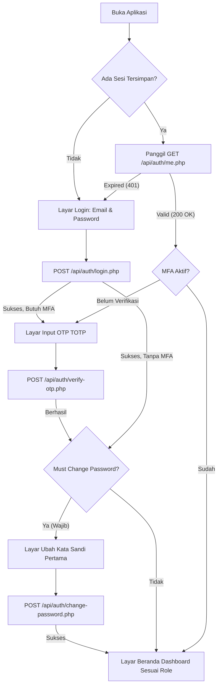

# MGI ERP Mobile App (Flutter) - Spesifikasi Kebutuhan Sistem, Alur Layar (Flow) & Panduan Integrasi API

Dokumen ini merupakan panduan arsitektur teknis dan spesifikasi kebutuhan pengembangan aplikasi mobile **Montana Global Investama (MGI) ERP** menggunakan **Flutter**. Dokumen ini dirancang untuk tim pengembang guna memetakan seluruh layar aplikasi, alur pengguna (*user flow*) multi-role, integrasi hardware (GPS Geofence, Kamera, Biometrik), dan integrasi menyeluruh ke endpoint API backend MGI ERP.

---

## DAFTAR ISI
1. [Arsitektur Teknis Aplikasi Flutter](#1-arsitektur-teknis-aplikasi-flutter)
2. [Sistem Autentikasi, Cookie & Manajemen Sesi](#2-sistem-autentikasi-cookie--manajemen-sesi)
3. [Alur Pengguna & Role-Based Navigation](#3-alur-pengguna--role-based-navigation)
4. [Katalog Layar, Komponen UI & Pemetaan API](#4-katalog-layar-komponen-ui--pemetaan-api)
   - [4.1 Modul Autentikasi & Keamanan Akun](#41-modul-autentikasi--keamanan-akun)
   - [4.2 Modul Beranda & Dasbor](#42-modul-beranda--dasbor)
   - [4.3 Modul Presensi & Lokasi (Attendance ESS)](#43-modul-presensi--lokasi-attendance-ess)
   - [4.4 Modul Perizinan & Cuti (Permit & Leave ESS)](#44-modul-perizinan--cuti-permit--leave-ess)
   - [4.5 Modul Profil & Dokumen Karyawan](#45-modul-profil--dokumen-karyawan)
   - [4.6 Modul Project Manager (PM Approval & Verification)](#46-modul-project-manager-pm-approval--verification)
   - [4.7 Modul HRGA Management (Permit, Sub-Permits & Attendance Recap)](#47-modul-hrga-management-permit-sub-permits--attendance-recap)
   - [4.8 Modul Pengajuan Biaya & Realisasi (Expense Ticketing)](#48-modul-pengajuan-biaya--realisasi-expense-ticketing)
5. [Model Data Utama (Dart Data Transfer Objects)](#5-model-data-utama-dart-data-transfer-objects)
6. [Keamanan Khusus Mobile (Anti-Fake GPS, Biometrik & Storage)](#6-keamanan-khusus-mobile-anti-fake-gps-biometrik--storage)
7. [Roadmap & Urutan Pengembangan Aplikasi (Sprint Plan)](#7-roadmap--urutan-pengembangan-aplikasi-sprint-plan)

---

## 1. Arsitektur Teknis Aplikasi Flutter

Untuk menjamin aplikasi berskala besar, mudah diuji (*testable*), dan mudah dirawat, struktur proyek Flutter disarankan mengadopsi **Clean Architecture (Feature-First Pattern)**.

### 1.1 Tech Stack yang Direkomendasikan
* **Framework**: Flutter SDK >= 3.22.x (Dart >= 3.4.x)
* **State Management**: `flutter_bloc` (Cubit/Bloc) atau `riverpod` (v2.x)
* **Networking / HTTP Client**: `dio` + `cookie_jar` + `dio_cookie_manager` *(Wajib untuk menangani PHP Session Cookie secara otomatis)*
* **Local Secure Storage**: `flutter_secure_storage` (untuk token, kredensial, biometrik flag)
* **Geolocation & Geofencing**: `geolocator` + `google_maps_flutter` / `flutter_map`
* **Media & Kamera**: `image_picker` + `flutter_image_compress` (kompresi foto sebelum upload)
* **File Picker**: `file_picker` (untuk PDF/surat dokter)
* **Biometric Auth**: `local_auth` (FaceID / Fingerprint login cepat)
* **Notifications**: `flutter_local_notifications` + Firebase Cloud Messaging (`firebase_messaging`)

### 1.2 Struktur Folder Proyek
```text
lib/
├── app/
│   ├── config/             # Environment, Base URL, App Constants
│   ├── routes/             # AppRouter (go_router atau auto_route)
│   └── themes/             # Color scheme, typography, Dark/Light theme
├── core/
│   ├── network/            # DioClient, Interceptors, CookieManager, ErrorHandler
│   ├── security/           # SecureStorageHelper, AntiFakeGpsDetector, BiometricHelper
│   ├── utils/              # DateFormatters, CurrencyFormatters, Validators
│   └── widgets/            # CustomButton, CustomTextField, StatusBadge, EmptyState
├── features/
│   ├── auth/               # Login, MFA TOTP, Must Change Password
│   ├── dashboard/          # Home summary, Quick stats, Role switcher
│   ├── attendance/         # GPS Geofence Check-in/Out, Break, Recap
│   ├── permit/             # Permit list, New Request, Attachment, Detail
│   ├── expense/            # Expense request, Camera receipt realization
│   ├── profile/            # Profile view, Edit request, Slip gaji
│   ├── pm_approvals/       # PM permit & expense verification
│   └── hrga_management/    # HRGA approval, Sub-permit config, Attendance recap
└── main.dart
```

---

## 2. Sistem Autentikasi, Cookie & Manajemen Sesi

Backend MGI ERP menggunakan **PHP Native Secure Session (`PHPSESSID`)** dengan proteksi *Rate Limiter*, *TOTP MFA (RFC 6238)*, dan flag *Must Change Password*.

### 2.1 Konfigurasi Dio & Cookie Jar di Flutter
```dart
import 'package:dio/dio.dart';
import 'package:dio_cookie_manager/dio_cookie_manager.dart';
import 'package:cookie_jar/cookie_jar.dart';
import 'package:path_provider/path_provider.dart';

Future<Dio> createDioClient(String baseUrl) async {
  final appDocDir = await getApplicationDocumentsDirectory();
  final cookieJar = PersistCookieJar(
    ignoreExpires: true,
    storage: FileStorage("${appDocDir.path}/.cookies/"),
  );

  final dio = Dio(BaseOptions(
    baseUrl: baseUrl,
    connectTimeout: const Duration(seconds: 15),
    receiveTimeout: const Duration(seconds: 15),
    headers: {
      'Accept': 'application/json',
      'X-Requested-With': 'XMLHttpRequest',
    },
  ));

  dio.interceptors.add(CookieManager(cookieJar));
  dio.interceptors.add(InterceptorsWrapper(
    onError: (DioException error, handler) {
      if (error.response?.statusCode == 401) {
        // Sesi expired -> arahkan kembali ke LoginScreen
      }
      return handler.next(error);
    },
  ));

  return dio;
}
```

### 2.2 Format Standar Response API Backend
Semua endpoint MGI ERP mengembalikan struktur JSON konsisten:
```json
{
  "success": true,
  "message": "Pesan status dari server",
  "data": { ... },
  "meta": {
    "page": 1,
    "limit": 20,
    "total": 50
  }
}
```
Jika terjadi kegagalan atau validasi ditolak:
```json
{
  "success": false,
  "message": "Penyebab error / validasi",
  "errors": {
    "email": "Email tidak valid"
  }
}
```

---

## 3. Alur Pengguna & Role-Based Navigation

### 3.1 Flowchart Autentikasi & First-Time Login


### 3.2 Matriks Hak Akses Berdasarkan Role
| Modul / Fitur | User / Karyawan (1) | HRGA (2) | Legal (3) | Finance (4) | PM (6) | Admin / IT (7) |
| :--- | :---: | :---: | :---: | :---: | :---: | :---: |
| **Presensi GPS (Check-in/Out, Istirahat)** | ✅ | ✅ | ✅ | ✅ | ✅ | ✅ |
| **Pengajuan Izin/Sakit/Cuti Mandiri** | ✅ | ✅ | ✅ | ✅ | ✅ | ✅ |
| **Lihat Slip Gaji & Profil Mandiri** | ✅ | ✅ | ✅ | ✅ | ✅ | ✅ |
| **Persetujuan Permit Tahap 1 (HRGA)** | ❌ | ✅ | ❌ | ❌ | ❌ | ✅ |
| **Kelola Sub-Jenis Izin & Cuti** | ❌ | ✅ | ❌ | ❌ | ❌ | ✅ |
| **Rekap Presensi Karyawan** | ❌ | ✅ | ❌ | ❌ | ❌ | ✅ |
| **Persetujuan Permit Tahap 2 (PM)** | ❌ | ❌ | ❌ | ❌ | ✅ | ✅ |
| **Persetujuan Pengajuan Biaya (PM)** | ❌ | ❌ | ❌ | ❌ | ✅ | ✅ |
| **Verifikasi Fisik & Bukti Nota Belanja**| ❌ | ❌ | ❌ | ❌ | ✅ | ✅ |
| **Monitoring Saldo Petty Cash** | ❌ | ✅ | ❌ | ✅ | ✅ | ✅ |
| **Manajemen Dokumen Legal** | ❌ | ❌ | ✅ | ❌ | ❌ | ✅ |
| **Manajemen Perangkat IT & Akses** | ❌ | ❌ | ❌ | ❌ | ❌ | ✅ |

---

## 4. Katalog Layar, Komponen UI & Pemetaan API

---

### 4.1 Modul Autentikasi & Keamanan Akun

#### 1. Layar Login (`/login`)
* **Tujuan**: Autentikasi kredensial pengguna.
* **Komponen UI**:
  * Logo MGI ERP, field Email, field Password (dengan toggle hide/show), tombol "Masuk", indikator lockout rate-limiting jika diblokir.
* **Integrasi API**:
  * **Endpoint**: `POST /backend/api/auth/login.php`
  * **Request Body**:
    ```json
    {
      "email": "karyawan@montana.co.id",
      "password": "Password123!"
    }
    ```
  * **Response Sukses**:
    ```json
    {
      "success": true,
      "message": "Login berhasil.",
      "data": {
        "user_id": 10,
        "email": "karyawan@montana.co.id",
        "role_id": 2,
        "role_name": "HRGA",
        "requires_mfa": false,
        "must_change_password": false
      }
    }
    ```
  * **Penanganan Error**:
    * Status `429 Too Many Requests`: Tampilkan dialog "Akun diblokir sementara karena 5x gagal login. Coba lagi dalam X menit."

#### 2. Layar Verifikasi MFA TOTP (`/mfa-verify`)
* **Tujuan**: Verifikasi 6-digit kode OTP jika akun mengaktifkan Two-Factor Authentication.
* **Komponen UI**:
  * 6-box OTP input field, tombol "Verifikasi Kode", tombol "Kirim Ulang / Bantuan".
* **Integrasi API**:
  * **Endpoint**: `POST /backend/api/auth/verify-otp.php`
  * **Request Body**:
    ```json
    {
      "otp": "592810"
    }
    ```
  * **Response Sukses**:
    ```json
    {
      "success": true,
      "message": "Verifikasi OTP berhasil.",
      "data": { "mfa_verified": true }
    }
    ```

#### 3. Layar Ubah Kata Sandi Wajib (`/change-password-mandatory`)
* **Tujuan**: Memaksa pengguna mengganti kata sandi default pada login perdana.
* **Komponen UI**:
  * Password Saat Ini, Password Baru, Konfirmasi Password Baru, Indikator Kekuatan Password (min 8 karakter, huruf kapital, angka, simbol).
* **Integrasi API**:
  * **Endpoint**: `POST /backend/api/auth/change-password.php`
  * **Request Body**:
    ```json
    {
      "current_password": "PasswordLama123",
      "new_password": "PasswordBaru456!",
      "confirm_password": "PasswordBaru456!"
    }
    ```

---

### 4.2 Modul Beranda & Dasbor

#### Layar Beranda Utama (`/home`)
* **Tujuan**: Dashboard ringkasan kehadiran hari ini, sisa kuota cuti, kartu akses cepat, dan daftar tugas persetujuan (untuk PM / HRGA).
* **Komponen UI**:
  * **Header**: Avatar foto profil, nama pengguna, badge Role, tombol Notifikasi.
  * **Widget Presensi Cepat**: Waktu saat ini (live clock), status hari ini (Belum Absen / Sudah Masuk / Istirahat / Selesai), tombol aksi cepat Check-In.
  * **Widget Saldo Cuti**: Sisa hari cuti tahunan, cuti terpakai.
  * **Approval Task Badge (PM/HRGA)**: Menampilkan counter jika ada permit atau expense pending review.
* **Integrasi API**:
  1. **Get Profile & Role**: `GET /backend/api/auth/me.php`
  2. **Get Leave Balance**: `GET /backend/api/user/leave-balance.php`
  3. **Get Dashboard Stats**: `GET /backend/api/dashboard/stats.php`
  4. **Get Attendance Today**: `GET /backend/api/attendance/my-attendance.php?month=MM&year=YYYY`

---

### 4.3 Modul Presensi & Lokasi (Attendance ESS)

#### 1. Layar Absensi GPS & Kamera (`/attendance/clock`)
* **Tujuan**: Melakukan absensi masuk (Check-in), istirahat, atau pulang (Check-out) berbasis Geofence kantor MGI.
* **Komponen UI**:
  * Mini-map interaktif yang menampilkan posisi GPS pengguna vs radius kantor (lingkaran geofence 50 meter).
  * Indikator Status: `Di Dalam Radius Kantor` (Hijau) atau `Di Luar Radius Kantor` (Merah).
  * Preview Kamera Depan (Selfie bukti kehadiran).
  * Field Catatan (Notes).
  * Tombol Aksi: Check In / Mulai Istirahat / Selesai Istirahat / Check Out.
* **Integrasi API**:
  * **1. Ambil Koordinat & Pengaturan Kantor**:
    * **Endpoint**: `GET /backend/api/attendance/settings.php`
    * **Response**:
      ```json
      {
        "success": true,
        "data": {
          "office_latitude": -6.2088,
          "office_longitude": 106.8456,
          "radius_meters": 100,
          "work_start_time": "08:30:00",
          "work_end_time": "17:30:00"
        }
      }
      ```
  * **2. Eksekusi Check-In**:
    * **Endpoint**: `POST /backend/api/attendance/check-in.php` (Multipart / Form-Data)
    * **Request**:
      * `latitude`: `-6.20881`
      * `longitude`: `106.84562`
      * `notes`: `Hadir tepat waktu`
      * `photo`: `[File Gambar Kamera]` *(opsional/sesuai setting)*
  * **3. Eksekusi Check-Out**:
    * **Endpoint**: `POST /backend/api/attendance/check-out.php`
    * **Request Body (JSON)**:
      ```json
      {
        "latitude": -6.20881,
        "longitude": 106.84562,
        "notes": "Selesai jam kerja"
      }
      ```
  * **4. Istirahat (Break Start & End)**:
    * `POST /backend/api/attendance/break-start.php`
    * `POST /backend/api/attendance/break-end.php`

#### 2. Layar Riwayat Presensi (`/attendance/history`)
* **Tujuan**: Melihat kalender kehadiran dan rekapan log bulanan.
* **Komponen UI**:
  * Kalender interaktif dengan dot warna (Hijau = Hadir, Kuning = Terlambat, Biru = Izin/Cuti, Merah = Alfa).
  * Kartu rekapitulasi: Total Hadir, Total Terlambat, Total Jam Lembur.
* **Integrasi API**:
  * **Endpoint**: `GET /backend/api/attendance/my-attendance.php?month=09&year=2026`

---

### 4.4 Modul Perizinan & Cuti (Permit & Leave ESS)

#### 1. Layar Riwayat & Status Pengajuan Izin (`/permits`)
* **Tujuan**: Menampilkan daftar semua pengajuan perizinan karyawan sendiri.
* **Komponen UI**:
  * Filter tab: Semua, Menunggu HRGA, Menunggu PM, Disetujui, Ditolak.
  * Card Item: Jenis izin & sub-tipe, rentang tanggal pengajuan, status badge, ikon lampiran berkas.
  * Floating Action Button (FAB): "Ajukan Izin Baru".
* **Integrasi API**:
  * **Endpoint**: `GET /backend/api/hrga/permits.php?page=1&limit=20`
  * *(Otomatis memfilter pengajuan milik user sendiri jika bukan role HRGA/PM)*.

#### 2. Layar Formulir Pengajuan Izin Baru (`/permits/create`)
* **Tujuan**: Mengajukan cuti tahunan, sakit, atau izin khusus.
* **Komponen UI**:
  * Dropdown **Kategori Izin Utama** (Hanya 3 pilihan unik: *Izin*, *Sakit*, *Cuti*).
  * Dropdown **Sub-Jenis Izin** (Dinonaktifkan sebelum kategori utama dipilih; memuat opsi dinamis sesuai kategori).
  * Date Picker: Tanggal Mulai (`start_date`) & Tanggal Selesai (`end_date`).
  * Text Area: Alasan / Keterangan (`description`).
  * File Picker / Camera: Lampiran Dokumen / Bukti Foto (`attachment`).
    * *Catatan Dinamis*: Jika sub-izin mewajibkan lampiran, teks merah muncul: *"Wajib lampirkan: [Label Dokumen]"*. Jika opsional, pengguna tetap dapat mengirim pengajuan tanpa foto.
* **Integrasi API**:
  * **1. Ambil Kategori Utama**:
    * **Endpoint**: `GET /backend/api/hrga/permit-types.php`
    * **Response**:
      ```json
      {
        "success": true,
        "data": [
          { "id": 1, "code": "izin", "name": "Izin", "requires_attachment": false },
          { "id": 2, "code": "sakit", "name": "Sakit", "requires_attachment": true },
          { "id": 3, "code": "cuti", "name": "Cuti", "requires_attachment": false }
        ]
      }
      ```
  * **2. Ambil Sub-Jenis Izin Berdasarkan Kategori**:
    * **Endpoint**: `GET /backend/api/hrga/permit-sub-types.php?category_id={category_id}&status=active`
    * **Response**:
      ```json
      {
        "success": true,
        "data": [
          {
            "id": 5,
            "category_id": 2,
            "name": "Sakit Ringan (1-2 Hari)",
            "requires_attachment": 0,
            "attachment_label": "Surat Dokter (Opsional)",
            "quota_days": null
          },
          {
            "id": 6,
            "category_id": 2,
            "name": "Sakit dengan Surat Dokter (>2 Hari)",
            "requires_attachment": 1,
            "attachment_label": "Surat Keterangan Dokter",
            "quota_days": null
          }
        ]
      }
      ```
  * **3. Submit Permohonan Izin**:
    * **Endpoint**: `POST /backend/api/hrga/permits.php` (Multipart / Form-Data)
    * **Form Fields**:
      * `permit_type_id`: `2`
      * `permit_sub_type_id`: `5`
      * `start_date`: `2026-09-20`
      * `end_date`: `2026-09-21`
      * `description`: `Sakit flu dan demam istirahat di rumah`
      * `attachment`: `[File JPEG/PNG/PDF]` *(opsional jika tidak ada berkas)*

---

### 4.5 Modul Profil & Dokumen Karyawan

#### 1. Layar Profil Karyawan (`/profile`)
* **Tujuan**: Menampilkan data pribadi karyawan, jabatan, departemen, dan kontak darurat.
* **Integrasi API**:
  * `GET /backend/api/profile/index.php`
  * `POST /backend/api/profile/photo.php` (Upload foto avatar baru)

#### 2. Layar Slip Gaji (Payslip) (`/profile/payslip`)
* **Tujuan**: Melihat dan mengunduh slip gaji bulanan karyawan dalam format aman.
* **Integrasi API**:
  * `GET /backend/api/user/payslip.php?month=08&year=2026`

---

### 4.6 Modul Project Manager (PM Approval & Verification)

#### 1. Layar Review Permit PM (`/pm/permits`)
* **Tujuan**: Project Manager melakukan approval tahap 2 setelah permit disetujui HRGA.
* **Komponen UI**:
  * List pengajuan berstatus `pending_pm`.
  * **Badge Khusus**:
    * Jika `has_attachment == 0`: Badge Merah **"Tanpa Bukti Foto"**.
    * Jika `has_attachment > 0`: Badge Hijau **"Ada Bukti Foto"**.
* **Integrasi API**:
  * **Daftar Permit PM**: `GET /backend/api/pm/permits.php?status=pending_pm`
  * **Detail Permit**: `GET /backend/api/hrga/permits-detail.php?id={id}`
  * **Approve Permit**: `POST /backend/api/hrga/permits-approve.php?id={id}`
    ```json
    { "note": "Disetujui oleh Project Manager." }
    ```
  * **Reject Permit**: `POST /backend/api/hrga/permits-reject.php?id={id}`
    ```json
    { "note": "Alasan penolakan pengajuan..." }
    ```

#### 2. Layar Verifikasi Fisik Belanja PM (`/pm/expense-verification`)
* **Tujuan**: Memvalidasi foto bukti nota dan foto fisik barang yang dibeli oleh tim operasional/HRGA.
* **Integrasi API**:
  * **Ambil Item Belanja**: `GET /backend/api/pm/expense-verify.php`
  * **Verifikasi Barang**: `POST /backend/api/pm/expense-verify.php`
    ```json
    {
      "expense_id": 15,
      "status": "verified",
      "note": "Barang sudah diterima di kantor cabang."
    }
    ```

---

### 4.7 Modul HRGA Management (Permit, Sub-Permits & Attendance Recap)

#### 1. Layar Approval Permit HRGA (`/hrga/permits`)
* **Tujuan**: Review perizinan seluruh karyawan pada tahap pertama.
* **Fitur Kritis di Mobile**:
  * **Peringatan Label Merah Tanpa Foto**:
    * Baris tabel / list view menampilkan:
      `<span class="badge bg-danger">Tanpa Bukti Foto</span>`
    * Pada detail modal: Kotak peringatan merah terang:
      > ⚠️ **Catatan Lampiran:** Pemohon **tidak mengunggah foto / dokumen bukti** pada pengajuan izin ini.
* **Integrasi API**:
  * **Daftar Permit HRGA**: `GET /backend/api/hrga/permits.php?status=pending_hrga`
  * **Detail Permit Lengkap**: `GET /backend/api/hrga/permits-detail.php?id={id}`
  * **Persetujuan HRGA**: `POST /backend/api/hrga/permits-approve.php?id={id}`

#### 2. Layar Kelola Sub-Jenis Izin & Cuti (`/hrga/sub-permits`)
* **Tujuan**: HRGA dapat menambah, mengubah kuota, mengaktifkan/menonaktifkan, dan **menghapus** sub-kategori izin (*Izin, Sakit, Cuti*).
* **Komponen UI**:
  * Dropdown Filter: Kategori Utama (*Semua, Izin, Sakit, Cuti*).
  * Tombol "+ Tambah Sub-Izin Baru".
  * List Card Sub-Izin:
    * Nama sub-izin & deskripsi.
    * Badge Kategori Utama.
    * Batas Kuota Hari (misal: 12 hari / per_year).
    * Switch Active / Inactive.
    * Tombol Edit & Tombol **Hapus (Delete)**.
* **Integrasi API**:
  * **1. List Sub-Izin**:
    * `GET /backend/api/hrga/permit-sub-types.php?status=all`
  * **2. Tambah Sub-Izin Baru**:
    * `POST /backend/api/hrga/permit-sub-types.php`
    ```json
    {
      "action": "create",
      "category_id": 2,
      "name": "Sakit Tanpa Surat Dokter (1 Hari)",
      "description": "Istirahat ringan karena kondisi badan kurang fit",
      "quota_days": 2,
      "quota_period": "per_year",
      "gender_restriction": "any",
      "is_paid": 1,
      "requires_attachment": 0,
      "attachment_label": ""
    }
    ```
  * **3. Update Sub-Izin**:
    * `POST /backend/api/hrga/permit-sub-types.php`
    ```json
    {
      "action": "update",
      "id": 5,
      "category_id": 2,
      "name": "Sakit Ringan Terverifikasi",
      "description": "Istirahat di rumah",
      "quota_days": 3,
      "quota_period": "per_year",
      "gender_restriction": "any",
      "is_paid": 1,
      "requires_attachment": 0,
      "attachment_label": ""
    }
    ```
  * **4. Hapus Sub-Izin (Delete)**:
    * `POST /backend/api/hrga/permit-sub-types.php`
    ```json
    {
      "action": "delete",
      "id": 12
    }
    ```
    * *Respon jika belum pernah dipakai*: Record dihapus permanen.
    * *Respon jika ada riwayat izin*: Otomatis diarsipkan / dinonaktifkan (`is_active = 0`) agar data riwayat karyawan tetap konsisten.
  * **5. Toggle Aktif/Nonaktif**:
    * `POST /backend/api/hrga/permit-sub-types.php`
    ```json
    {
      "action": "toggle_status",
      "id": 5,
      "is_active": 0
    }
    ```

---

### 4.8 Modul Pengajuan Biaya & Realisasi (Expense Ticketing)

#### 1. Layar Tiket Pengajuan Biaya (`/expenses`)
* **Tujuan**: Pembuatan tiket permohonan dana operasional lapangan atau kantor.
* **Integrasi API**:
  * `GET /backend/api/hrga/expense-requests.php`
  * `POST /backend/api/hrga/expense-requests.php`

#### 2. Layar Unggah Realisasi & Foto Nota (`/expenses/realization`)
* **Tujuan**: Mengunggah foto nota fisik dan foto barang belanjaan menggunakan kamera mobile.
* **Komponen UI**:
  * Tombol ambil foto nota (kamera), tombol ambil foto fisik barang, input nominal realisasi, input sisa dana kembalian.
* **Integrasi API**:
  * `POST /backend/api/hrga/expense-realization.php` (Multipart / Form-Data)

---

## 5. Model Data Utama (Dart Data Transfer Objects)

Berikut adalah contoh implementasi Model Data Dart yang sesuai dengan JSON backend MGI ERP:

### 5.1 UserModel (`user_model.dart`)
```dart
class UserModel {
  final int id;
  final String email;
  final String name;
  final int roleId;
  final String roleName;
  final String? photoPath;
  final bool mfaVerified;
  final bool mustChangePassword;

  UserModel({
    required this.id,
    required this.email,
    required this.name,
    required this.roleId,
    required this.roleName,
    this.photoPath,
    required this.mfaVerified,
    required this.mustChangePassword,
  });

  factory UserModel.fromJson(Map<String, dynamic> json) {
    return UserModel(
      id: json['id'] is int ? json['id'] : int.parse(json['id'].toString()),
      email: json['email'] ?? '',
      name: json['name'] ?? 'Karyawan',
      roleId: json['role_id'] is int ? json['role_id'] : int.parse(json['role_id'].toString()),
      roleName: json['role_name'] ?? 'User',
      photoPath: json['photo_path'],
      mfaVerified: json['mfa_verified'] == true || json['mfa_verified'] == 1,
      mustChangePassword: json['must_change_password'] == true || json['must_change_password'] == 1,
    );
  }
}
```

### 5.2 PermitModel (`permit_model.dart`)
```dart
class PermitModel {
  final int id;
  final int userId;
  final String employeeEmail;
  final String permitTypeName;
  final int? permitSubTypeId;
  final String? permitSubTypeName;
  final String startDate;
  final String endDate;
  final String description;
  final String status;
  final int hasAttachment;
  final String createdAt;

  PermitModel({
    required this.id,
    required this.userId,
    required this.employeeEmail,
    required this.permitTypeName,
    this.permitSubTypeId,
    this.permitSubTypeName,
    required this.startDate,
    required this.endDate,
    required this.description,
    required this.status,
    required this.hasAttachment,
    required this.createdAt,
  });

  bool get isWithoutPhoto => hasAttachment == 0;

  factory PermitModel.fromJson(Map<String, dynamic> json) {
    return PermitModel(
      id: json['id'] is int ? json['id'] : int.parse(json['id'].toString()),
      userId: json['user_id'] is int ? json['user_id'] : int.parse(json['user_id'].toString()),
      employeeEmail: json['employee_email'] ?? '',
      permitTypeName: json['permit_type_name'] ?? '',
      permitSubTypeId: json['permit_sub_type_id'] != null ? int.tryParse(json['permit_sub_type_id'].toString()) : null,
      permitSubTypeName: json['permit_sub_type_name'],
      startDate: json['start_date'] ?? '',
      endDate: json['end_date'] ?? '',
      description: json['description'] ?? '',
      status: json['status'] ?? 'pending_hrga',
      hasAttachment: json['has_attachment'] != null ? int.parse(json['has_attachment'].toString()) : 0,
      createdAt: json['created_at'] ?? '',
    );
  }
}
```

### 5.3 PermitSubTypeModel (`permit_sub_type_model.dart`)
```dart
class PermitSubTypeModel {
  final int id;
  final int categoryId;
  final String categoryName;
  final String name;
  final String? description;
  final bool requiresAttachment;
  final String? attachmentLabel;
  final double? quotaDays;
  final String quotaPeriod;
  final String genderRestriction;
  final bool isPaid;
  final bool isActive;

  PermitSubTypeModel({
    required this.id,
    required this.categoryId,
    required this.categoryName,
    required this.name,
    this.description,
    required this.requiresAttachment,
    this.attachmentLabel,
    this.quotaDays,
    required this.quotaPeriod,
    required this.genderRestriction,
    required this.isPaid,
    required this.isActive,
  });

  factory PermitSubTypeModel.fromJson(Map<String, dynamic> json) {
    return PermitSubTypeModel(
      id: int.parse(json['id'].toString()),
      categoryId: int.parse(json['category_id'].toString()),
      categoryName: json['category_name'] ?? '',
      name: json['name'] ?? '',
      description: json['description'],
      requiresAttachment: json['requires_attachment'] == 1 || json['requires_attachment'] == true,
      attachmentLabel: json['attachment_label'],
      quotaDays: json['quota_days'] != null ? double.tryParse(json['quota_days'].toString()) : null,
      quotaPeriod: json['quota_period'] ?? 'per_year',
      genderRestriction: json['gender_restriction'] ?? 'any',
      isPaid: json['is_paid'] == 1 || json['is_paid'] == true,
      isActive: json['is_active'] == 1 || json['is_active'] == true,
    );
  }
}
```

---

## 6. Keamanan Khusus Mobile (Anti-Fake GPS, Biometrik & Storage)

### 6.1 Deteksi Lokasi Palsu (Anti Mock Location)
Untuk mencegah manipulasi kehadiran oleh karyawan, gunakan pengecekan mock location:
```dart
import 'package:geolocator/geolocator.dart';

Future<Position?> determineSafePosition() async {
  bool serviceEnabled = await Geolocator.isLocationServiceEnabled();
  if (!serviceEnabled) {
    throw Exception('Layanan GPS perangkat belum diaktifkan.');
  }

  LocationPermission permission = await Geolocator.checkPermission();
  if (permission == LocationPermission.denied) {
    permission = await Geolocator.requestPermission();
    if (permission == LocationPermission.denied) {
      throw Exception('Izin akses lokasi ditolak oleh pengguna.');
    }
  }

  final position = await Geolocator.getCurrentPosition(
    desiredAccuracy: LocationAccuracy.high,
  );

  // Deteksi Mock Location pada Android / iOS
  if (position.isMocked) {
    throw Exception('Terdeteksi penggunaan Lokasi Palsu (Fake GPS). Presensi dibatalkan!');
  }

  return position;
}
```

### 6.2 Kompresi Gambar Otomatis Sebelum Upload
Menghindari beban jaringan dan error batas upload 5MB server:
```dart
import 'dart:io';
import 'package:flutter_image_compress/flutter_image_compress.dart';

Future<File?> compressImageFile(File file) async {
  final targetPath = "${file.parent.path}/compressed_${DateTime.now().millisecondsSinceEpoch}.jpg";
  final result = await FlutterImageCompress.compressAndGetFile(
    file.absolute.path,
    targetPath,
    quality: 75,
    minWidth: 1080,
    minHeight: 1080,
  );
  return result != null ? File(result.path) : null;
}
```

---

## 7. Roadmap & Urutan Pengembangan Aplikasi (Sprint Plan)

```text
Sprint 1: Pondasi & Autentikasi (2 Minggu)
├── Setup Base Project Flutter + Clean Architecture + Dio CookieJar
├── Login Screen + Validasi Rate Limiting
├── Two-Factor Auth (MFA TOTP) + Mandatory Password Change
└── Splash Screen & Sesi Auto-Login Check (/api/auth/me.php)

Sprint 2: Employee Self Service - Presensi & Cuti (2 Minggu)
├── GPS Geofencing + Selfie Clock-In & Clock-Out
├── Riwayat Presensi & Rekap Kehadiran
├── Formulir Pengajuan Izin Baru (Dropdown Kategori & Sub-Izin Dinamis)
└── Upload Bukti Lampiran & Riwayat Pengajuan Izin

Sprint 3: Modul HRGA Management (2 Minggu)
├── List Approval Permit HRGA (Dengan Badge Merah "Tanpa Bukti Foto")
├── Modal Detail Permit & Peringatan Dokumen Tidak Lengkap
├── Manajemen Sub-Jenis Izin (Tambah, Edit, Toggle, Hapus dengan Proteksi Arsip)
└── Rekapitulasi Presensi Seluruh Karyawan

Sprint 4: Modul Project Manager (PM) (1.5 Minggu)
├── Layar Approval Permit Tahap 2 (PM Review)
├── Layar Approval Pengajuan Biaya (Expense Tickets)
├── Layar Verifikasi Fisik Barang & Nota Belanja
└── Monitoring Saldo Petty Cash

Sprint 5: Testing, Hardening & Deployment (1.5 Minggu)
├── Pengujian Anti-Mock Location (Fake GPS test)
├── Pengujian Transisi Jaringan (Offline / Bad Network)
├── Build Release APK & App Bundle (Android) / IPA (iOS)
└── Distribusi Internal Testing / Firebase App Distribution
```

---
*Dokumen ini dibuat dan disesuaikan secara langsung dengan kode backend sistem Montana Global Investama Internal ERP.*
