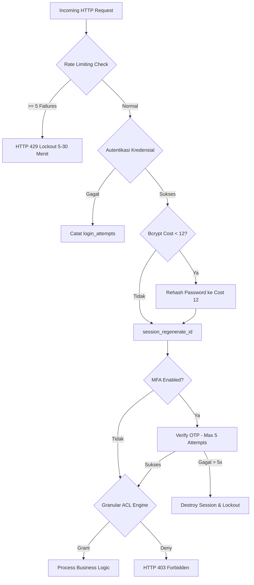
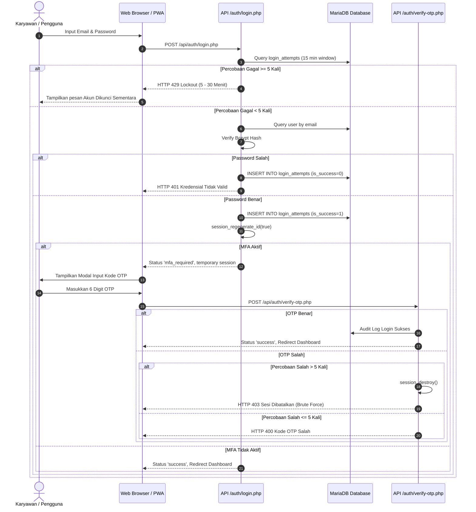
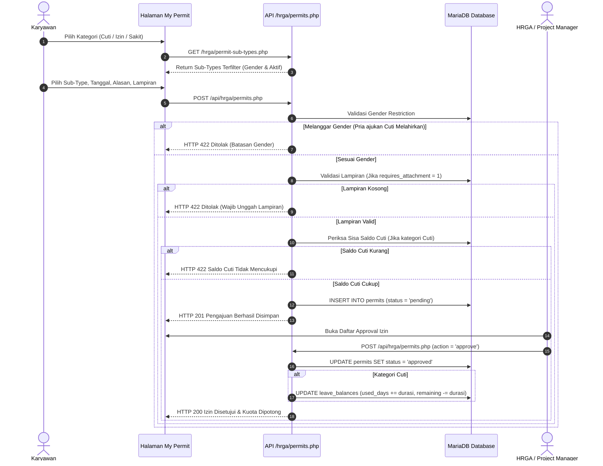
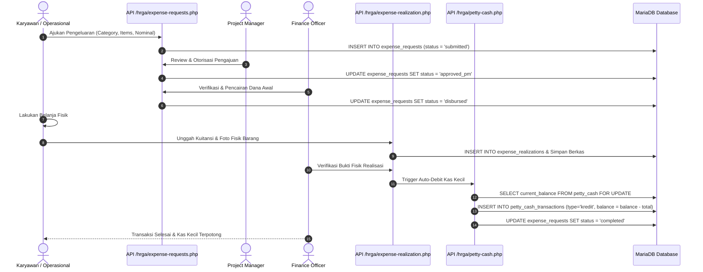
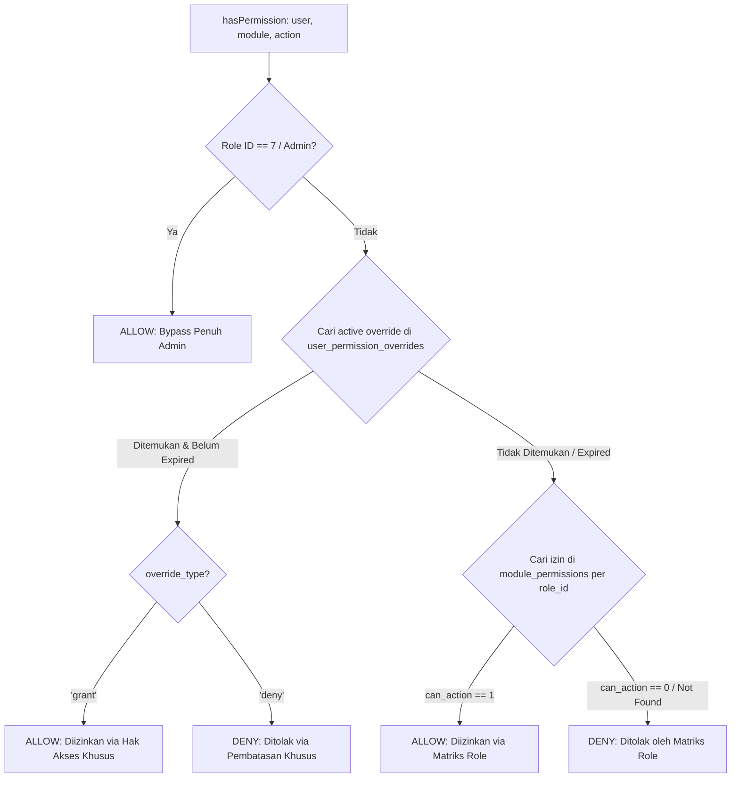
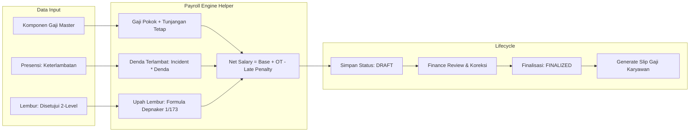

# 🏢 DOKUMENTASI TEKNIS LENGKAP: MONTANA GLOBAL INVESTAMA ERP (MGI ERP)

> **Versi Sistem**: 2.5.0-Enterprise  
> **Klasifikasi Dokumen**: Master Technical & Architecture Specification  
> **Terakhir Diperbarui**: September 2026  
> **Arsitektur**: Monolith Modern Modular (PHP 8.2+ PDO, MariaDB, Vanilla ES6+ SPA Architecture, PWA Mobile-Ready)

---

## 📑 DAFTAR ISI
1. [Ringkasan Eksekutif & Filosofi Sistem](#1-ringkasan-eksekutif--filosofi-sistem)
2. [Technology Stack & Arsitektur Perangkat Lunak](#2-technology-stack--arsitektur-perangkat-lunak)
3. [Arsitektur Keamanan (Security Hardening & Enterprise Guardrails)](#3-arsitektur-keamanan-security-hardening--enterprise-guardrails)
4. [Katalog Fitur Komprehensif per Modul Bisnis](#4-katalog-fitur-komprehensif-per-modul-bisnis)
   - [4.1 Modul IT & Keamanan Sistem](#41-modul-it--keamanan-sistem)
   - [4.2 Modul HRGA (Human Resources & General Affairs)](#42-modul-hrga-human-resources--general-affairs)
   - [4.3 Modul Finance & Kas Kecil (Petty Cash)](#43-modul-finance--kas-kecil-petty-cash)
   - [4.4 Modul Payroll Terintegrasi (Penggajian)](#44-modul-payroll-terintegrasi-penggajian)
   - [4.5 Modul Legal & Manajemen Dokumen](#45-modul-legal--manajemen-dokumen)
   - [4.6 Modul Project Management (PM) & Operasional](#46-modul-project-management-pm--operasional)
   - [4.7 Modul Administrator & Master Data Center](#47-modul-administrator--master-data-center)
5. [Diagram Alur Bisnis (Workflow Mermaid Diagrams)](#5-diagram-alur-bisnis-workflow-mermaid-diagrams)
   - [5.1 Alur Autentikasi, Rate Limiting & 2FA](#51-alur-autentikasi-rate-limiting--2fa)
   - [5.2 Alur Pengajuan Cuti / Izin & Pengurangan Kuota](#52-alur-pengajuan-cuti--izin--pengurangan-kuota)
   - [5.3 Alur Pengajuan Biaya & Siklus Kas Kecil (Expense Lifecycle)](#53-alur-pengajuan-biaya--siklus-kas-kecil-expense-lifecycle)
   - [5.4 Alur Evaluasi Hak Akses Granular (Access Control Engine)](#54-alur-evaluasi-hak-akses-granular-access-control-engine)
   - [5.5 Alur Penggajian Otomatis (Payroll Engine Flow)](#55-alur-penggajian-otomatis-payroll-engine-flow)
6. [Kamus Data & Skema Basis Data (Database Schema)](#6-kamus-data--skema-basis-data-database-schema)
7. [Katalog Endpoint REST API](#7-katalog-endpoint-rest-api)
8. [Panduan Deployment, Backup & Pemulihan Sistem](#8-panduan-deployment-backup--pemulihan-sistem)

---

## 1. RINGKASAN EKSEKUTIF & FILOSOFI SISTEM

**Montana Global Investama ERP (MGI ERP)** adalah sistem informasi enterprise terintegrasi yang dirancang khusus untuk mengelola operasional internal korporasi multi-divisi PT Montana Global Investama. Sistem mengintegrasikan seluruh alur kerja lintas departemen: **IT**, **HRGA**, **Legal**, **Finance**, **Business Development**, **Project Management**, dan **Executive Board/Administrator**.

### Prinsip Desain Arsitektur:
1. **Ultra-Fast & Lightweight (Zero Framework Bloat)**:
   Dibangun dengan PHP Native berorientasi objek fungsional dan Vanilla ES6+ tanpa ketergantungan framework berat (*no heavy vendors/dependencies*). Kecepatan waktu muat (*load time*) rata-rata di bawah 80 milidetik.
2. **Strict Security by Design**:
   Menerapkan standar hardening enterprise: proteksi brute force bertingkat, penolakan webshell berbasis *magic-bytes MIME detection*, enkripsi Bcrypt cost 12, rotasi ID sesi otomatis, dan isolasi file upload via `.htaccess`.
3. **Data Integrity & Concurrency Lock**:
   Operasi pembukuan keuangan (kas kecil dan penggajian) menerapkan isolasi transaksi database atomic (`Pessimistic Locking / FOR UPDATE`) untuk menjamin zero race condition.
4. **Dynamic Granular Master Data**:
   Konfigurasi izin modul, sub-kategori izin cuti, dan pagu pengeluaran bersifat dinamis melalui basis data tanpa perlu mengubah kode sumber (*zero downtime configuration*).
5. **PWA Mobile-Ready**:
   Dilengkapi Web App Manifest dan Service Worker offline fallback untuk mendukung presensi dan pemantauan tugas langsung dari smartphone karyawan (*Add to Home Screen*).

---

## 2. TECHNOLOGY STACK & ARSITEKTUR PERANGKAT LUNAK

| Lapisan (Layer) | Teknologi | Peran & Karakteristik |
| :--- | :--- | :--- |
| **Backend Runtime** | PHP 8.2+ (Engine CLI / Apache Handler) | Menjalankan logika bisnis, pemrosesan transaksi, validasi otentikasi. |
| **Database Abstraction** | PHP Data Objects (PDO) | Interaksi basis data 100% menggunakan *Parameterized Prepared Statements* untuk imun terhadap SQL Injection. |
| **Database Server** | MariaDB 10.4+ / MySQL 8.0+ | Engine InnoDB, Foreign Key Cascade Constraints, ACID Compliance, Row-level Locking. |
| **Frontend UI** | Semantic HTML5 & Vanilla CSS3 | Menggunakan CSS Custom Properties (Variables), Glassmorphism, Micro-interactions, Responsive Grid & Flexbox. |
| **Frontend Scripting** | Vanilla JavaScript (ES6+) | Arsitektur SPA (Single Page Application) modular, REST Fetch API, Toast Notification Engine, Dynamic Modals. |
| **Web Server** | Apache 2.4+ (XAMPP / Linux Production) | URL rewriting (`.htaccess`), Gzip Compression, Request Filtering. |
| **Mobile Integration** | Progressive Web App (PWA) | `manifest.json` & `sw.js` (Cache-first untuk aset statis, network-first untuk REST API, background caching). |
| **Autentikasi & Sesi** | Native PHP Sessions + TOTP 2FA | Bcrypt Password Hashing (`cost = 12`), Session Fixation Regeneration, Cookie HTTP-only. |

---

## 3. ARSITEKTUR KEAMANAN (SECURITY HARDENING & ENTERPRISE GUARDRAILS)

Sistem MGI ERP menerapkan pertahanan berlapis (*Defense-in-Depth*):



### 1. Proteksi Brute-Force & Rate Limiting (`backend/helpers/auth.php`)
- Setiap percobaan login dicatat ke tabel `login_attempts` (`email`, `ip_address`, `attempted_at`, `is_success`).
- **Aturan Exponential Backoff (Window 15 Menit)**:
  - Gagal $\ge 5$ kali: Penguncian akses (*Lockout*) selama **5 menit** (HTTP 429 Too Many Requests).
  - Gagal $\ge 10$ kali: Penguncian akses (*Lockout*) selama **30 menit** (HTTP 429).
- Saat login sukses, seluruh riwayat kegagalan untuk email dan alamat IP tersebut langsung dibersihkan otomatis.

### 2. Standar Kriptografi Password (Bcrypt Cost 12)
- Hashing password menggunakan algoritma `PASSWORD_BCRYPT` dengan beban kerja dinaikkan ke **Cost 12**.
- Dilengkapi fungsi `rehashPasswordIfNeeded()` saat login berhasil: akun lama yang masih menggunakan Cost 10 akan di-upgrade secara senyap ke Cost 12 tanpa memerlukan reset password manual.

### 3. Proteksi Sesi & Dua Faktor (2FA / OTP Security)
- Setiap sesi sementara OTP dibatasi maksimal **5 kali percobaan salah**. Jika melebihi batas, sesi langsung dihancurkan (`session_destroy()`) dan pengguna dipaksa mengulang login dari awal.
- Saat autentikasi atau OTP valid, ID sesi langsung dirotasi menggunakan `session_regenerate_id(true)` untuk memitigasi serangan *Session Fixation*.

### 4. Validasi Magic-Bytes Anti-Webshell pada File Upload (`backend/helpers/upload.php`)
- Validasi berkas fisik tidak hanya memeriksa ekstensi atau header `$_FILES['type']`, melainkan membaca signature byte internal menggunakan ekstensi PHP `finfo_file()`.
- Menolak berkas berekstensi ganda atau format skrip yang disamarkan (misalnya `nota.jpg.php`, file `.exe`, `.sh`, `.php`).
- Nama berkas dienkripsi menggunakan *cryptographic random bytes* (16 bytes hex) + stempel waktu acak untuk mencegah *Path Traversal* dan *File Guessing*.
- Seluruh folder penyimpanan (`backend/uploads/` dan `backend/storage/`) diproteksi file `.htaccess` (`Deny from all`) sehingga berkas tidak dapat dieksekusi langsung via browser.

### 5. Mesin Evaluasi Izin Granular 3-Tier (`hasPermission()`)
Evaluasi wewenang aksi (`view`, `create`, `edit`, `delete`, `approve`) dijalankan dengan urutan prioritas:
1. **Tier 1 (Admin Bypass)**: Pengguna dengan `role_id = 7` (Admin) selalu mendapatkan hak akses penuh (`true`).
2. **Tier 2 (User Permission Overrides)**: Pengecualian spesifik pada tabel `user_permission_overrides` yang aktif dan belum kedaluwarsa (`grant` $\rightarrow$ izinkan, `deny` $\rightarrow$ tolak). Setiap override wajib menyertakan alasan (*reason*) untuk kebutuhan audit investigasi.
3. **Tier 3 (Role Default Matrix)**: Mengacu pada matriks default tabel `module_permissions` berdasarkan `role_id`.

### 6. Wajib Ganti Kata Sandi pada Login Pertama (Force Password Change on First Login)
- Setiap akun baru yang dibuat oleh role **IT** atau **Admin** secara otomatis memiliki flag `force_password_change = 1` di tabel `users`.
- Tindakan reset kata sandi oleh IT/Admin juga mengaktifkan kembali status `force_password_change = 1`.
- **Enforcement Alur Kerja**:
  - Pada saat login pertama kali (atau pasca OTP), sistem mengembalikan payload `must_change_password: true` dan menetapkan penanda sesi `$_SESSION['must_change_password'] = true`.
  - Frontend secara otomatis mengalihkan pengguna ke halaman [frontend/change-password.html](file:///c:/xampp/htdocs/Montana-Global-Investama-ERP/frontend/change-password.html).
  - Middleware `requireAuth()` memblokir akses ke seluruh endpoint aplikasi lainnya dengan respon HTTP 403 (`must_change_password: true`) hingga kata sandi baru berhasil disimpan.
  - Endpoint [backend/api/auth/change-password.php](file:///c:/xampp/htdocs/Montana-Global-Investama-ERP/backend/api/auth/change-password.php) memvalidasi kata sandi lama, memastikan kata sandi baru minimal 8 karakter dan berbeda dari kata sandi lama, mengenkripsi dengan Bcrypt Cost 12, lalu me-reset flag `force_password_change = 0`.

---

## 4. KATALOG FITUR KOMPREHENSIF PER MODUL BISNIS

### 4.1 Modul IT & Keamanan Sistem
- **Manajemen Inventaris Perangkat IT (`it_devices`)**:
  - Pencatatan aset perangkat keras kantor (laptop, PC desktop, monitor, printer, router).
  - Tracking nomor seri, spesifikasi teknis, kondisi fisik, tanggal pembelian, dan riwayat peminjaman karyawan.
- **Manajemen Akun Email Perusahaan (`it_emails`)**:
  - Registrasi email korporasi (`@mgi.co.id`), alokasi kuota penyimpanan, status aktif/nonaktif, dan keterkaitan dengan profil karyawan.
- **Access Control Matrix Center (`frontend/pages/it/access-control.html`)**:
  - Matriks interaktif untuk mengatur hak akses 7 Role terhadap 11 Modul sistem.
  - Form pemberian *User Override* (hak khusus atau pembatasan sementara) dengan tanggal kedaluwarsa otomatis.
- **Audit Trail & Logging (`audit_logs`)**:
  - Pencatatan otomatis setiap aksi penting (login, perubahan data, approval, penghapusan) mencakup user ID, action, deskripsi, IP address, dan timestamp.

### 4.2 Modul HRGA (Human Resources & General Affairs)
- **Presensi Pintar Berbasis Geolocation & Geofencing**:
  - Check-in & Check-out mandiri menggunakan koordinat GPS browser.
  - Validasi radius geofence kantor (otomatis mendeteksi jika karyawan berada di luar zona kantor).
  - Fitur istirahat kerja (*Break Out* & *Break In*) dengan penghitungan durasi istirahat.
  - Deteksi otomatis status keterlambatan (*Late In*) dan pulang lebih awal (*Early Out*).
- **Sub-Jenis Izin & Cuti Dinamis (`permit_sub_types`)**:
  - Master data izin yang dapat dikonfigurasi tanpa coding:
    1. *Cuti Tahunan* (Memotong saldo cuti tahunan).
    2. *Cuti Melahirkan* (Khusus karyawan wanita, 90 hari, tidak memotong cuti tahunan).
    3. *Cuti Istri Melahirkan* (Khusus karyawan pria, 2 hari).
    4. *Izin Menikah* (3 hari).
    5. *Izin Khitan / Baptis Anak* (2 hari).
    6. *Izin Duka Keluarga Meninggal* (2 hari).
    7. *Izin Tugas Luar / Dinas* (Fleksibel).
    8. *Izin Keperluan Pribadi Mendesak* (1 hari).
    9. *Sakit Ringan Tanpa Surat Dokter* (1 hari).
    10. *Sakit Dengan Surat Dokter* (Wajib lampiran bukti medis).
    11. *Rawat Inap / Sakit Berat* (Wajib surat opname/rawat inap).
  - Validasi otomatis batasan gender (*gender restriction*).
  - Validasi kewajiban lampiran (*attachment required enforcement*).
- **Manajemen Kuota Saldo Cuti Tahunan (`leave_balances`)**:
  - Kuota cuti tahunan default 12 hari kerja.
  - Pengurangan otomatis (*auto-decrement*) saat pengajuan cuti berstatus disetujui (*Approved*).
  - Validasi pencegahan saldo negatif (pengajuan otomatis ditolak jika saldo tidak mencukupi).
- **Lembur Karyawan (Overtime Management)**:
  - Formulir pengajuan lembur mandiri sebelum/sesudah jam kerja.
  - Alur persetujuan 2 tingkat: **Project Manager (Level 1)** $\rightarrow$ **HRGA (Level 2)**.
- **Siklus Hidup Karyawan (Employee Lifecycle)**:
  - Checklist Onboarding untuk karyawan baru (penyerahan aset IT, tanda tangan NDA, pembuatan email).
  - Checklist Offboarding untuk karyawan keluar (pengembalian aset, penutupan email, exit interview, penghitungan hak akhir).
- **Pengajuan Perubahan Profil Karyawan**:
  - Pengajuan pembaruan kontak, alamat, atau rekening oleh karyawan yang diverifikasi oleh HRGA sebelum diterapkan ke basis data.

### 4.3 Modul Finance & Kas Kecil (Petty Cash)
- **Buku Mutasi Kas Kecil Terproteksi Concurrency (`petty_cash_transactions`)**:
  - Pencatatan transaksi debit (top-up) dan kredit (pengeluaran kas kecil).
  - Penghitungan saldo berjalan (*running balance*) berbasis row-level locking (`FOR UPDATE`) untuk mencegah kondisi balapan (*race conditions*).
- **Pengajuan Biaya Operasional & Proyek (Expense Requests)**:
  - Multi-item line ticketing untuk pengadaan barang atau operasional lapangan.
  - Alur persetujuan bertingkat: **Project Manager Approval** $\rightarrow$ **Finance Verification & Disbursement**.
- **Realisasi Belanja & Verifikasi Nota Fisik (Expense Realization)**:
  - Unggah bukti kuitansi nota dan foto fisik barang setelah belanja dilakukan.
  - Pemotongan kas kecil otomatis setelah bukti realisasi divalidasi oleh divisi Finance.
- **Sub-Kategori Pengeluaran & Pagu Bulanan (`expense_categories`)**:
  - Master data kategori biaya dengan pagu anggaran bulanan (*Monthly Budget Limit*):
    1. Operasional Lapangan & Kantor (Pagu: Rp 10.000.000, GL: 6101-OPR)
    2. Pengadaan Proyek & Material (Pagu: Rp 50.000.000, GL: 6201-PRJ)
    3. Alat Tulis & Perlengkapan Kantor (Pagu: Rp 5.000.000, GL: 6102-ATK)
    4. Perjalanan Dinas & Transportasi (Pagu: Rp 15.000.000, GL: 6301-TRV)
    5. Konsumsi & Jamuan Rapat (Pagu: Rp 5.000.000, GL: 6103-CSM)
    6. Kebutuhan Darurat / Lain-lain (Pagu: Rp 5.000.000, GL: 6999-OTH)
  - Visualisasi progress pemakaian pagu real-time (*Month-to-Date Spending* vs Pagu Anggaran).

### 4.4 Modul Payroll Terintegrasi (Penggajian)
- **Komponen Gaji Fleksibel (`payroll_components`)**:
  - Gaji Pokok (*Basic Salary*).
  - Tunjangan Tetap (*Fixed Allowances* jabatan/transportasi/makan).
- **Mesin Perhitungan Otomatis (`backend/helpers/payroll.php`)**:
  - **Penghitungan Upah Lembur**: Mengacu standar ketenagakerjaan:  
    $$\text{Upah Lembur per Jam} = \frac{\text{Gaji Pokok} + \text{Tunjangan Tetap}}{173}$$
    - Jam ke-1: $1.5 \times \text{Upah per Jam}$
    - Jam ke-2 dan seterusnya: $2.0 \times \text{Upah per Jam}$
  - **Penghitungan Denda Keterlambatan**:
    - Denda nominal otomatis per insiden keterlambatan dari data presensi bulan terkait.
- **Siklus Hidup Payroll (`payroll_runs`)**:
  - Pembuatan kalkulasi dalam status **Draft** (memungkinkan Finance melakukan peninjauan dan koreksi).
  - Finalisasi status ke **Finalized** (mengunci slip gaji permanen dan siap cetak).

### 4.5 Modul Legal & Manajemen Dokumen
- **Repository Dokumen Digital (`documents`)**:
  - Pengarsipan dokumen kontrak kerjasama, akta pendirian, izin usaha, SOP, dan perjanjian hukum.
  - Klasifikasi tingkat kerahasiaan (*Confidentiality Level*: Public, Internal, Confidential, Secret).
  - Pelacakan masa berlaku dokumen dengan notifikasi kedaluwarsa otomatis.
- **Pengendalian Hak Akses Dokumen (`document_access`)**:
  - Pembatasan unduh dan baca per divisi/role untuk melindungi kerahasiaan data korporasi.

### 4.6 Modul Project Management (PM) & Operasional
- **Review & Approval Pengajuan Divisi**:
  - Otorisasi pengajuan lembur anggota tim proyek.
  - Otorisasi pengajuan biaya operasional proyek sebelum diajukan ke Finance.
  - Otorisasi pengajuan cuti/izin karyawan di bawah supervisi PM.

### 4.7 Modul Administrator & Master Data Center
- **Master Data Configuration Center (`frontend/pages/admin/master-data.html`)**:
  - Pusat kendali terpadu untuk mengelola kategori pengeluaran, batasan anggaran, sub-jenis izin, dan hak akses.
- **Executive Reporting & Exporting**:
  - Rekapitulasi laporan presensi, absensi, pengeluaran kas kecil, dan rekapitulasi penggajian bulanan dengan opsi cetak / PDF.
- **Database Backup Center (`backup_database.php`)**:
  - Utilitas pencadangan basis data terkompresi (`.sql.gz`) dengan kebijakan retensi pembersihan otomatis file yang berumur lebih dari 30 hari.

---

## 5. DIAGRAM ALUR BISNIS (WORKFLOW MERMAID DIAGRAMS)

### 5.1 Alur Autentikasi, Rate Limiting & 2FA



---

### 5.2 Alur Pengajuan Cuti / Izin & Pengurangan Kuota



---

### 5.3 Alur Pengajuan Biaya & Siklus Kas Kecil (Expense Lifecycle)



---

### 5.4 Alur Evaluasi Hak Akses Granular (Access Control Engine)



---

### 5.5 Alur Penggajian Otomatis (Payroll Engine Flow)



---

## 6. KAMUS DATA & SKEMA BASIS DATA (DATABASE SCHEMA)

Berikut adalah ringkasan struktur 32 tabel basis data `mgi_erp`:

| No | Nama Tabel | Deskripsi & Fungsi Utama | Relasi Utama / Foreign Key |
| :---: | :--- | :--- | :--- |
| 1 | `roles` | Master 7 role pengguna (IT, HRGA, Legal, Finance, BizDev, PM, Admin). | - |
| 2 | `users` | Akun login, kredensial password hash (Bcrypt cost 12), status, MFA secret. | FK: `roles(id)` |
| 3 | `user_profiles` | Informasi biodata karyawan, nomor telepon, tanggal bergabung, gender, alamat. | FK: `users(id)` |
| 4 | `login_attempts` | Log histori percobaan autentikasi untuk proteksi brute force rate limiting. | Index: `(email, attempted_at)` |
| 5 | `sessions` | Sesi login pengguna aktif dengan stempel rotasi sesi. | FK: `users(id)` |
| 6 | `module_permissions` | Matriks izin per role (can_view, create, edit, delete, approve) untuk 11 modul. | FK: `roles(id)` |
| 7 | `user_permission_overrides` | Pengecualian hak akses user spesifik (grant/deny) beserta alasan dan tanggal kedaluwarsa. | FK: `users(id)` |
| 8 | `attendance_locations` | Titik koordinat GPS kantor pusat, radius geofence (meter), dan status aktif. | - |
| 9 | `attendance_settings` | Jam kerja standar kantor (jam masuk, jam pulang, jam mulai & selesai istirahat). | - |
| 10 | `attendances` | Riwayat presensi check-in, check-out, break-out, break-in, status late, dan koordinat. | FK: `users(id)` |
| 11 | `permit_types` | Master kategori izin utama (cuti, izin, sakit). | - |
| 12 | `permit_sub_types` | Master 11 sub-jenis izin dinamis dengan batasan gender, lampiran, dan max days. | - |
| 13 | `permits` | Pengajuan izin/cuti karyawan, tanggal mulai, tanggal selesai, alasan, dan status approval. | FK: `users(id)`, `permit_sub_types(id)` |
| 14 | `permit_approvals` | Riwayat persetujuan bertingkat izin/cuti (approver_id, level, status, catatan). | FK: `permits(id)`, `users(id)` |
| 15 | `permit_attachments` | Berkas surat dokter atau bukti keterangan izin. | FK: `permits(id)` |
| 16 | `leave_balances` | Saldo dan kuota cuti tahunan karyawan (kuota 12 hari, pemakaian, sisa kuota). | FK: `users(id)`, `permit_types(id)` |
| 17 | `overtime_requests` | Pengajuan jam lembur karyawan beserta hasil approval 2 tingkat (PM & HRGA). | FK: `users(id)` |
| 18 | `expense_categories` | Master kategori biaya dengan pagu bulanan (budget limit) dan kode akun GL. | - |
| 19 | `expense_requests` | Tiket pengajuan pengeluaran biaya operasional dan proyek. | FK: `users(id)`, `expense_categories(id)` |
| 20 | `expense_request_items` | Rincian baris barang/jasa yang diajukan (nama, kuantitas, estimasi harga satuan). | FK: `expense_requests(id)` |
| 21 | `petty_cash_transactions` | Buku kas kecil mutasi debit/kredit dengan concurrency locking. | FK: `expense_requests(id)` |
| 22 | `payroll_components` | Master nominal gaji pokok dan tunjangan tetap per karyawan. | FK: `users(id)` |
| 23 | `payroll_runs` | Riwayat kalkulasi slip penggajian bulanan (status draft/finalized, breakdown take-home pay). | FK: `users(id)` |
| 24 | `it_devices` | Inventaris aset perangkat keras IT, nomor seri, dan penanggung jawab aset. | FK: `users(id)` (assigned_to) |
| 25 | `it_emails` | Manajemen alokasi email korporasi `@mgi.co.id`. | FK: `users(id)` |
| 26 | `documents` | Repository arsip dokumen legal, kontrak kerjasama, dan izin operasional. | FK: `users(id)` (uploaded_by) |
| 27 | `document_access` | Pengaturan visibilitas dan izin unduh dokumen per divisi. | FK: `documents(id)`, `roles(id)` |
| 28 | `profile_change_requests` | Pengajuan perubahan data biodata diri oleh karyawan. | FK: `users(id)` |
| 29 | `profile_change_request_items` | Rincian per kolom yang diajukan untuk diubah beserta nilai lama dan nilai baru. | FK: `profile_change_requests(id)` |
| 30 | `lifecycle_checklists` | Item checklist orientasi (onboarding) atau terminasi (offboarding) karyawan. | FK: `users(id)` |
| 31 | `notifications` | Notifikasi lonceng sistem secara real-time ke akun target. | FK: `users(id)` |
| 32 | `audit_logs` | Catatan audit trail setiap aksi sistem untuk forensik keamanan data. | FK: `users(id)` |

---

## 7. KATALOG ENDPOINT REST API

Seluruh endpoint menghasilkan respon berformat JSON baku:
```json
{
  "success": true,
  "message": "Deskripsi respon status",
  "data": {}
}
```

| Modul | Method | Endpoint URL | Parameter / Payload Utama | Hak Akses (Auth) |
| :--- | :---: | :--- | :--- | :--- |
| **Auth** | `POST` | `/backend/api/auth/login.php` | `email`, `password` | Publik (Rate Limited) |
| **Auth** | `POST` | `/backend/api/auth/verify-otp.php` | `otp_code` | Sesi Login Sementara |
| **Auth** | `POST` | `/backend/api/auth/change-password.php` | `current_password`, `new_password`, `confirm_password` | Sesi Aktif / First Login |
| **Auth** | `GET` | `/backend/api/auth/me.php` | - | Sesi Aktif |
| **Auth** | `POST` | `/backend/api/auth/logout.php` | - | Sesi Aktif |
| **Attendance** | `GET` | `/backend/api/user/attendance.php` | `month`, `year` | Karyawan / Admin |
| **Attendance** | `POST` | `/backend/api/user/attendance.php` | `action` (check_in, check_out, break_out, break_in), `lat`, `lng` | Karyawan |
| **Permit** | `GET` | `/backend/api/hrga/permit-sub-types.php` | `category`, `is_active` | Sesi Aktif |
| **Permit** | `POST` | `/backend/api/hrga/permit-sub-types.php` | `name`, `category`, `gender_restriction`, `requires_attachment`, `max_days` | HRGA / Admin |
| **Permit** | `POST` | `/backend/api/hrga/permits.php` | `permit_sub_type_id`, `start_date`, `end_date`, `reason`, `attachment` | Karyawan |
| **Permit** | `PUT` | `/backend/api/hrga/permits.php` | `id`, `action` (approve/reject), `notes` | PM / HRGA / Admin |
| **Finance** | `GET` | `/backend/api/finance/expense-categories.php` | - | Finance / Admin |
| **Finance** | `POST` | `/backend/api/finance/expense-categories.php` | `name`, `code`, `monthly_budget_limit`, `gl_account_code` | Finance / Admin |
| **Finance** | `POST` | `/backend/api/hrga/expense-requests.php` | `category_id`, `items[]`, `total_amount`, `notes` | Staff / Karyawan |
| **Finance** | `POST` | `/backend/api/hrga/expense-realization.php` | `request_id`, `actual_amount`, `receipt_file`, `photo_file` | Staff / Finance |
| **Finance** | `GET` | `/backend/api/hrga/petty-cash.php` | `start_date`, `end_date` | Finance / Admin |
| **Payroll** | `GET` | `/backend/api/finance/payroll.php` | `month`, `year`, `status` | Finance / Admin |
| **Payroll** | `POST` | `/backend/api/finance/payroll.php` | `action` (generate_run, finalize_run), `month`, `year` | Finance / Admin |
| **IT Control**| `GET` | `/backend/api/it/access-control.php` | `action` (matrix / overrides) | IT / Admin |
| **IT Control**| `POST` | `/backend/api/it/access-control.php` | `action` (update_matrix / add_override / revoke_override) | IT / Admin |

---

## 8. PANDUAN DEPLOYMENT, BACKUP & PEMULIHAN SISTEM

### A. Prasyarat Lingkungan Produksi
- **Web Server**: Apache 2.4+ dengan modul `mod_rewrite` dan `mod_headers` aktif.
- **PHP Version**: PHP 8.2 atau lebih tinggi.
- **Ekstensi PHP Wajib**: `pdo_mysql`, `fileinfo`, `session`, `json`, `mbstring`, `zlib`, `gd`.
- **Database**: MariaDB Server versi 10.4 ke atas atau MySQL 8.0+.

### B. Prosedur Instalasi Bersih (*Fresh Deployment*)
1. Pindahkan seluruh isi repositori ke document root web server (misalnya: `C:/xampp/htdocs/Montana-Global-Investama-ERP` atau `/var/www/html/mgi-erp`).
2. Pastikan file konfigurasi database pada `backend/config/database.php` mengarah ke host, port, user, dan password database yang sesuai:
   ```php
   define('DB_HOST', 'localhost');
   define('DB_PORT', '3306');
   define('DB_NAME', 'mgi_erp');
   define('DB_USER', 'root');
   define('DB_PASS', '');
   ```
3. Jalankan skrip inisialisasi basis data dan migrasi:
   ```bash
   php fresh_reset_and_seed.php
   php migrate_security_hardening.php
   php migrate_attendance_break.php
   php migrate_leave_balances.php
   php migrate_overtime_and_lifecycle.php
   php migrate_payroll.php
   php migrate_granular_master_data.php
   ```

### C. Akun Bawaan Sistem (*Default Credentials*)
Setelah inisialisasi, sistem menyediakan akun bawaan untuk pengujian dengan password awal: `Password123!`
- **Administrator**: `admin@mgi.co.id`
- **IT Support Admin**: `it@mgi.co.id`
- **HRGA Officer**: `hrga@mgi.co.id`
- **Legal Officer**: `legal@mgi.co.id`
- **Finance Officer**: `finance@mgi.co.id`
- **Business Development**: `bizdev@mgi.co.id`
- **Project Manager**: `pm@mgi.co.id`

> [!IMPORTANT]
> Sangat disarankan untuk segera mengganti kata sandi default seluruh akun resmi dan mengaktifkan 2FA saat sistem mulai digunakan di lingkungan operasional nyata.

### D. Pencadangan Otomatis (*Database Backup & Recovery*)
Sistem telah dilengkapi utilitas pencadangan database mandiri di `backup_database.php`.
- **Menjalankan Pencadangan Manual**:
  ```bash
  php backup_database.php
  ```
- **Otomasi via Cronjob (Linux)**:
  Tambahkan baris berikut ke crontab server untuk pencadangan harian setiap pukul 02:00 dini hari:
  ```cron
  0 2 * * * /usr/bin/php /var/www/html/mgi-erp/backup_database.php > /dev/null 2>&1
  ```
- **Kebijakan Retensi**: Berkas `.sql.gz` disimpan di `backend/storage/backups/`. Skrip secara otomatis menghapus berkas backup yang usianya telah melampaui **30 hari** guna menghemat kapasitas penyimpanan server.
- **Prosedur Pemulihan (*Restore*)**:
  Ekstrak file `.gz` terkait, lalu impor ke MySQL CLI:
  ```bash
  gzip -d backup_mgi_erp_YYYYMMDD_HHMMSS.sql.gz
  mysql -u root -p mgi_erp < backup_mgi_erp_YYYYMMDD_HHMMSS.sql
  ```

---

*Dokumen ini merupakan panduan teknis resmi bagi tim pengembang, system administrator, dan audit compliance PT Montana Global Investama.*
